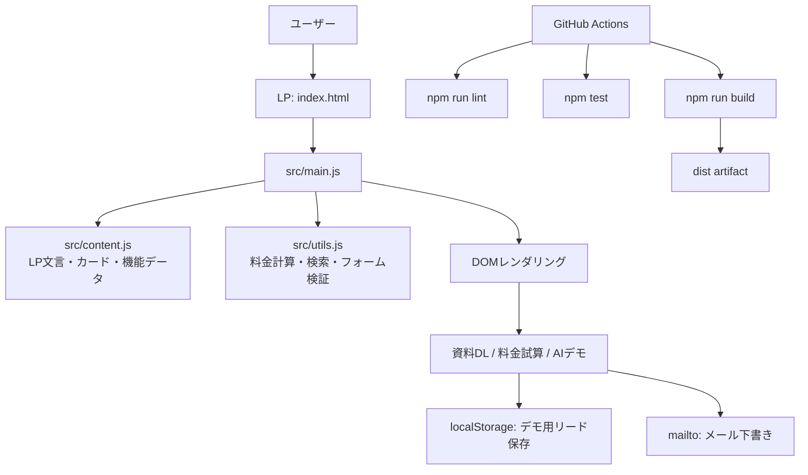

# CallNest AI Landing Page

AI電話受付サービスのランディングページ再現デモです。参考LPの「ヒーロー → デモ通話CTA → 導入事例 → 代表電話の利用イメージ → 選ばれる理由 → 機能一覧 → 料金 → 資料DL」という流れを、架空ブランド **CallNest AI** とオリジナル文言で再構成しています。

> 注意: 既存企業のロゴ、画像、商標、文章、数値をコピーしないように作っています。商用公開する場合は、自社ブランド・実料金・実事例・法務確認済み表現へ差し替えてください。

## できること

- AI電話受付LPのレスポンシブUI
- ヒーローCTA、デモ番号、AI通話デモ表示
- 業種別の導入イメージカード
- 代表電話のAI対応フロー
- 選ばれる理由セクション
- 機能一覧の検索フィルター
- 月額料金の簡易シミュレーター
- 資料DLフォームのバリデーションとメール下書きリンク
- FAQ
- GitHub Actions CI
- Codespaces / Dev Container 対応

## 技術スタック

| 領域 | 採用 |
| --- | --- |
| フロントエンド | Vite + Vanilla JavaScript |
| スタイル | CSS custom properties + responsive layout |
| テスト | Vitest |
| Lint | ESLint flat config |
| CI/CD | GitHub Actions |
| 開発環境 | Dev Container / Codespaces |

## ローカル実行

```bash
npm install
npm run dev
```

ブラウザで Vite が表示するURLを開きます。通常は `http://localhost:5173` です。

## テストとビルド

```bash
npm run lint
npm test
npm run build
```

ビルド成果物は `dist/` に出力されます。GitHub Actions では `ai-call-landing-page-dist` というartifact名でアップロードされます。

## 全体アーキテクチャ



## 処理の流れ

1. `index.html` が `src/main.js` を読み込みます。
2. `src/content.js` のLPデータを使い、ヒーロー、事例、機能、料金、FAQをDOMへ描画します。
3. ユーザーが「AI通話デモ」を押すと、会話サンプルが展開されます。
4. 料金シミュレーターでは `estimateMonthlyCost()` が電話番号数・月間着信数・AIオプションから概算金額を計算します。
5. 機能検索では `searchFeatures()` が機能タグを絞り込みます。
6. 資料DLフォームは `validateLead()` で入力を検証し、デモとして `localStorage` に保存し、メール下書きリンクを表示します。
7. GitHub Actions が lint、test、build を実行し、`dist/` をartifactとして保存します。

## GPT Images 2.0 でアーキテクチャ説明画像を作るためのプロンプト

READMEと `docs/architecture.md` にはMermaid図を入れています。非エンジニア向けの説明資料を画像で作る場合は、GPT Images 2.0 などの最新画像生成モデルに次のプロンプトを渡してください。

```text
日本語のSaaSランディングページ開発アーキテクチャ図を、初心者向けに明るく読みやすいインフォグラフィックとして作成してください。
登場要素: ユーザー、Vite静的LP、src/content.js、src/main.js、src/utils.js、料金シミュレーター、資料DLフォーム、localStorage、mailto、GitHub Actions、lint、test、build、dist artifact。
左から右へ処理が流れる構成。色はティール、白、薄いシアン、アクセントにオレンジ。各矢印に短い説明ラベルを入れる。商標ロゴは使わない。
```

## 本番公開に必要なもの

このrepoはフロントエンド再現デモです。本番運用には次が必要です。

| 項目 | 必要な対応 |
| --- | --- |
| 電話受電 | Twilio、Vonage、Amazon Connect、国内電話APIなどの契約と番号取得 |
| AI応答 | 音声認識、LLM、音声合成、会話フロー、有人転送の設計 |
| フォーム送信 | CRM、メール配信、MA、Google Sheets、Webhookなどの送信先 |
| 個人情報 | プライバシーポリシー、利用目的、保管期間、録音同意、削除導線 |
| セキュリティ | HTTPS、Secret管理、監査ログ、アクセス制御 |
| 計測 | Google Analytics、広告タグ、CV計測、Cookie同意 |
| 法務 | 景表法、特商法、電気通信関連、業界別規制の確認 |
| コンテンツ | 実料金、導入事例、ロゴ利用許諾、実績数値の根拠 |

## 初期設定ガイド

### Codespacesで開く

1. GitHubのrepo画面で `Code` を押します。
2. `Codespaces` タブを選びます。
3. `Create codespace on main` を押します。
4. 起動後、自動で `npm install` が実行されます。
5. ターミナルで `npm run dev` を実行します。
6. ポート `5173` のプレビューを開きます。

### GitHub Pagesへ公開する場合

このrepoにはPagesデプロイworkflowはまだ入れていません。静的ホスティングへ公開する場合は次のいずれかを選びます。

- GitHub Pages: `dist/` をPages artifactとしてデプロイするworkflowを追加
- Vercel / Netlify: repo連携後、Build command を `npm run build`、Publish directory を `dist` に設定
- S3 / Cloudflare Pages: `dist/` をアップロード、またはGit連携

## 主要ファイル

```text
.
├── index.html
├── src/
│   ├── content.js
│   ├── main.js
│   ├── styles.css
│   └── utils.js
├── tests/
│   └── utils.test.js
├── .github/workflows/ci.yml
├── .devcontainer/devcontainer.json
├── docs/
│   ├── architecture.md
│   ├── architecture.mmd
│   └── setup.md
└── CODEX.md
```

## カスタマイズ箇所

LP文言・機能・事例・料金は `src/content.js` に集約しています。まずここを編集すると全体を差し替えやすいです。

色・余白・カードデザインは `src/styles.css` の `:root` 変数から調整できます。

## ライセンス

MIT
