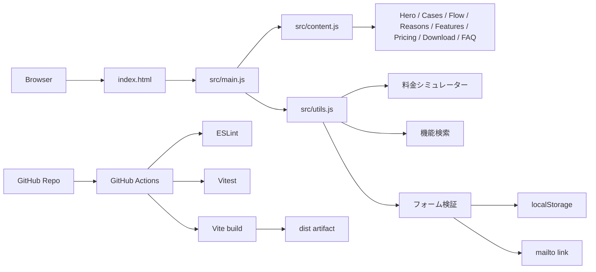
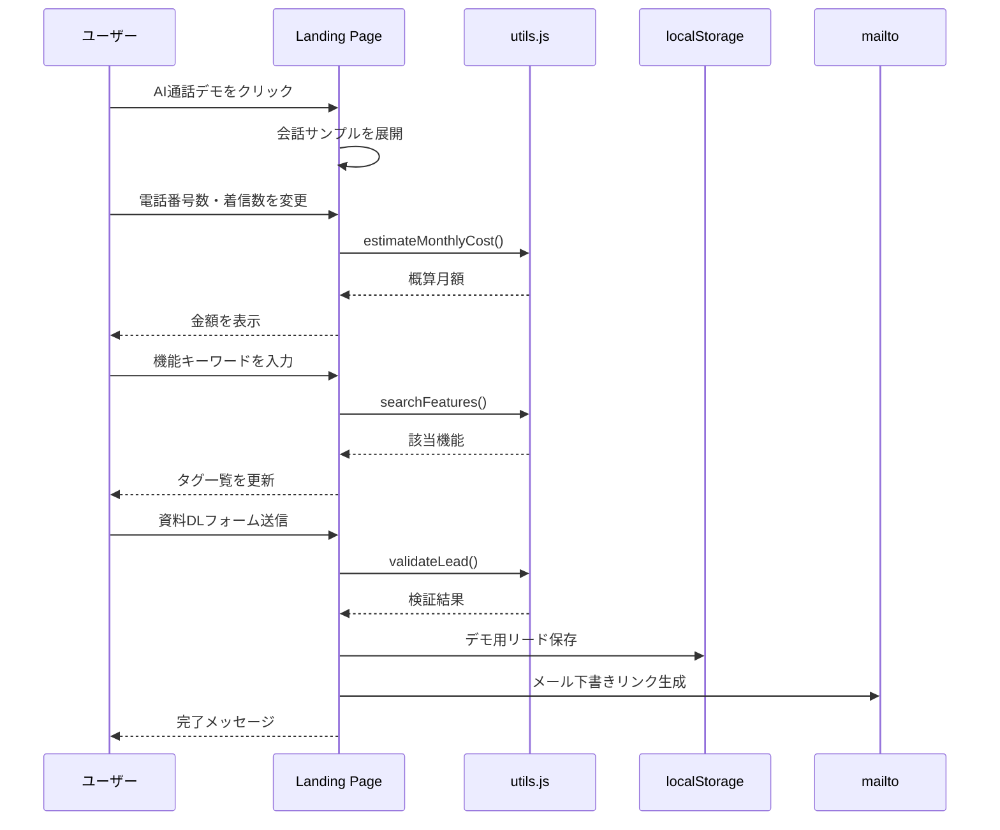
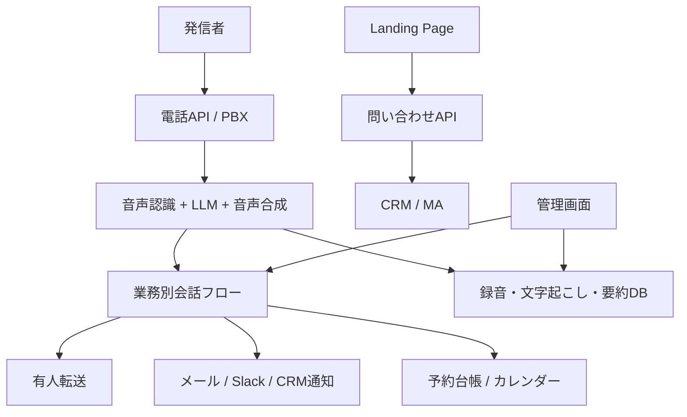

# Architecture

このドキュメントは、CallNest AI Landing Page の構造、処理の流れ、本番化に必要な拡張を説明します。

## 目的

AI電話受付サービスの広告LPを、既存ページのコピーではなく、同じような情報設計・CTA設計・CV導線を持つオリジナルLPとして再現します。

## システム構成



## データ設計

`src/content.js` にLPで使う静的データを集約しています。

- `site`: ブランド名、電話番号、ヒーロー文言、CTA
- `logoNames`: 架空の導入想定企業名
- `industries`: 業種別ユースケース
- `reasons`: 選ばれる理由
- `features`: 機能一覧
- `callFlowSteps`: 代表電話のAI対応フロー
- `pricing`: 料金シミュレーターの単価
- `documents`: 資料DL欄の内容
- `faqItems`: FAQ
- `demoTranscript`: AI通話デモの会話例

この設計により、営業文言の編集とDOM描画ロジックを分離しています。

## UIレンダリング

`src/main.js` は次の順で動作します。

1. `content.js` からLPデータを読み込みます。
2. `renderApp()` でページ全体のHTMLを生成します。
3. `bindInteractions()` でボタン、検索、料金計算、フォーム送信イベントを登録します。
4. ユーザー操作に応じてDOMを部分更新します。

## ユーザー操作の処理フロー



## CI/CD

`.github/workflows/ci.yml` は次を実行します。

1. `actions/checkout@v4`
2. `actions/setup-node@v4`
3. `npm install`
4. `npm run lint`
5. `npm test`
6. `npm run build`
7. `actions/upload-artifact@v4` で `dist/` を保存

イベントは `push`、`pull_request`、`workflow_dispatch` です。

## 本番化アーキテクチャ案

現状はフロントエンドのみのデモです。本番では次の構成に拡張します。



## Secrets

このデモではSecretsは不要です。本番で想定されるSecrets名は次の通りです。実値はrepoに保存しません。

| Secret名 | 用途 |
| --- | --- |
| `PHONE_PROVIDER_API_KEY` | 電話APIの認証 |
| `OPENAI_API_KEY` | AI応答・要約・文字起こし |
| `CRM_WEBHOOK_URL` | 問い合わせ送信先 |
| `SLACK_WEBHOOK_URL` | 通知送信先 |
| `DATABASE_URL` | 通話履歴・顧客情報DB |
| `ENCRYPTION_KEY` | 録音・個人情報の暗号化 |

## GPT Images 2.0 用の図解生成プロンプト

```text
AI電話受付ランディングページのアーキテクチャを説明する横長の日本語インフォグラフィックを作ってください。
左から「ユーザー」「Vite LP」「main.js」「content.js」「utils.js」「料金計算」「フォーム検証」「localStorage」「mailto」「GitHub Actions」「dist artifact」へ流れる図。
初心者でもわかるように、各箱に短い説明を添える。ティールと白を基調に、アクセントはオレンジ。商標ロゴや既存企業名は使わない。
```

## 今後の拡張

- フォームをサーバーレスAPIへ接続
- GitHub Pages / Cloudflare Pages / Vercel デプロイworkflow追加
- 実デモ通話APIとの接続
- 管理画面と着信フロー編集機能
- 多言語対応
- A/Bテストと広告CV計測
- E2Eテスト追加
